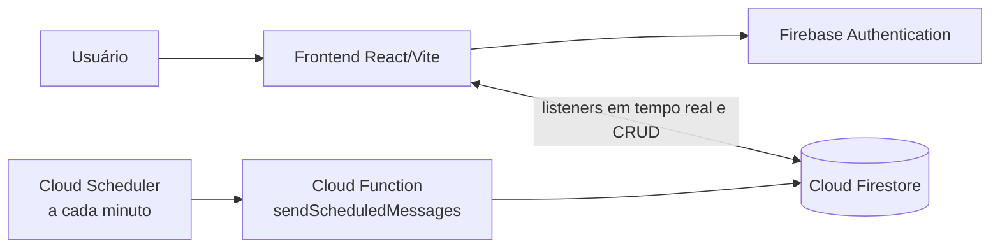
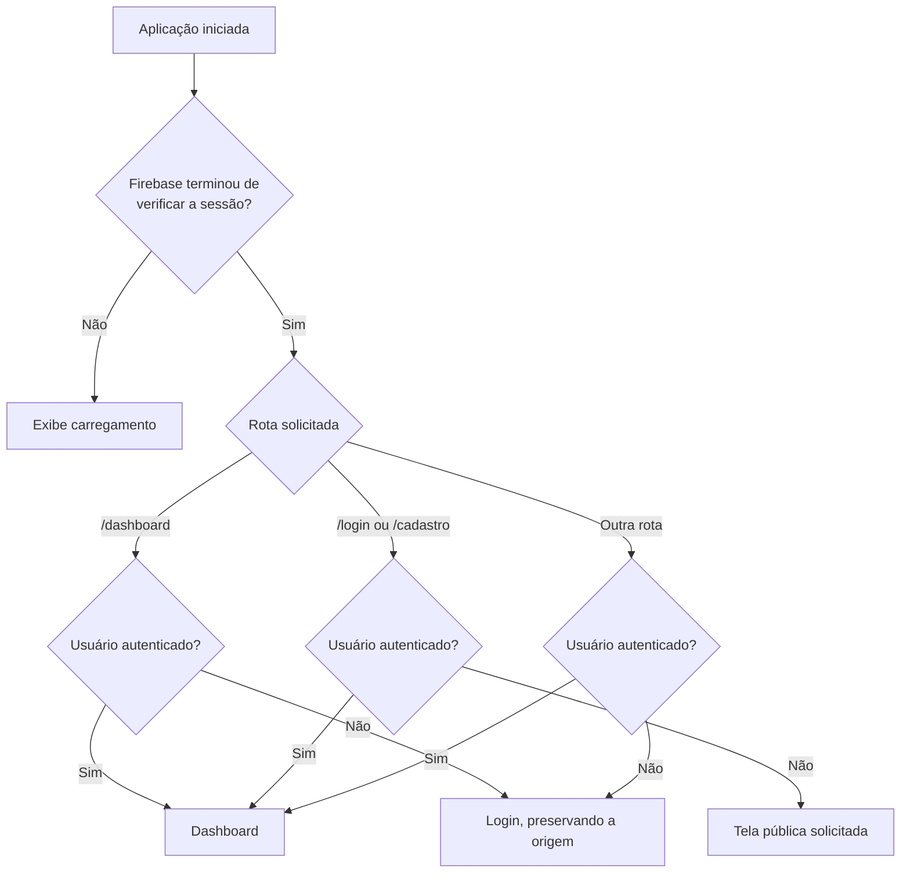
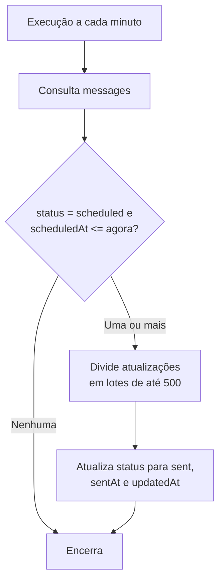
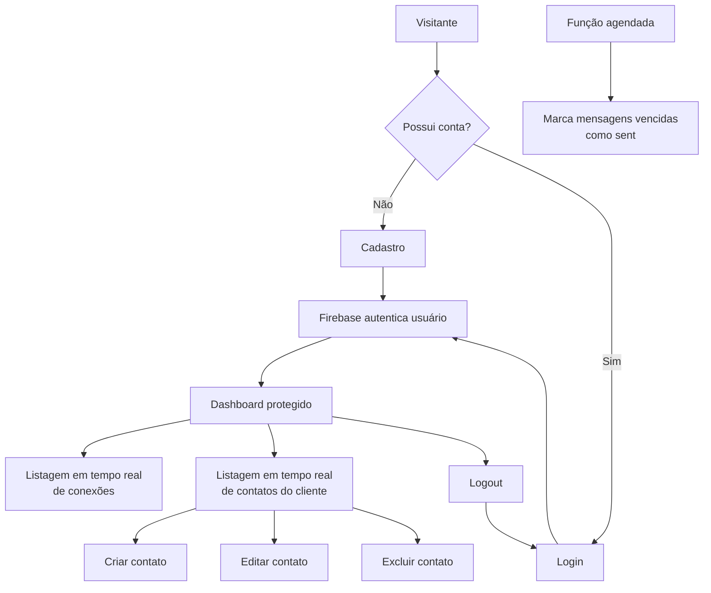

# Entendimento dos fluxos atuais

> Documento baseado no estado atual do código em 22/09/2026. Ele descreve o que já está implementado e diferencia esse comportamento do escopo previsto em `diretries.md`.

## 1. Visão geral

O Broadcast é um SaaS multi-tenant em construção para gerenciamento de conexões, contatos e mensagens. Neste momento, o sistema possui:

- cadastro, login, persistência de sessão e logout com Firebase Authentication;
- proteção de rotas no frontend;
- listagem em tempo real das conexões pertencentes ao usuário autenticado;
- CRUD de contatos do usuário autenticado, com atualização em tempo real;
- isolamento dos dados por `clientId` nas regras do Firestore;
- uma função agendada que transforma mensagens vencidas de `scheduled` para `sent`.

Ainda não existem na interface o CRUD de conexões nem os fluxos de criação, listagem, filtro, edição ou exclusão de mensagens. Os contatos também são exibidos atualmente no nível da conta, e não dentro de uma conexão específica.

## 2. Arquitetura atual



### Componentes principais

| Camada | Responsabilidade atual |
| --- | --- |
| `web/` | Aplicação React + TypeScript criada com Vite |
| React Router | Rotas públicas e rota protegida do dashboard |
| Material UI + Tailwind CSS | Componentes e estilização da interface |
| Firebase Authentication | Cadastro, login, sessão e logout por e-mail/senha |
| Cloud Firestore | Persistência de conexões, contatos e mensagens |
| Firebase Functions | Processamento periódico das mensagens agendadas |
| Firebase Hosting | Publicação do conteúdo de `web/dist`, com fallback para a SPA |

## 3. Ator e isolamento SaaS

O único ator representado hoje é o **cliente autenticado**. O identificador desse cliente é o `uid` fornecido pelo Firebase Authentication.

Os documentos das coleções `connections`, `contacts` e `messages` usam o campo `clientId`. As regras do Firestore comparam esse campo com `request.auth.uid` para impedir que um cliente leia ou altere dados de outro cliente.

```text
Firebase Auth user.uid
        │
        └── clientId dos documentos do Firestore
              ├── connections
              ├── contacts
              └── messages
```

Não há uma coleção `clients` nem um perfil de cliente criado durante o cadastro.

## 4. Fluxo de inicialização e roteamento

1. A aplicação inicializa o Firebase usando as variáveis `VITE_FIREBASE_*`.
2. O `AuthProvider` registra um observador com `onAuthStateChanged`.
3. Enquanto o Firebase verifica a sessão, a aplicação mostra um indicador de carregamento em tela cheia.
4. Depois da verificação:
   - `/login` apresenta o login;
   - `/cadastro` apresenta o cadastro;
   - `/dashboard` passa pelo componente `ProtectedRoute`;
   - qualquer rota desconhecida redireciona para `/dashboard` quando há usuário ou para `/login` quando não há.
5. Se uma pessoa sem sessão tentar abrir `/dashboard`, o caminho solicitado é salvo em `location.state.from` e ela é enviada ao login.
6. Depois de um login bem-sucedido, a pessoa retorna ao caminho salvo ou segue para `/dashboard`.



## 5. Fluxo de cadastro

1. O usuário acessa `/cadastro`.
2. Informa e-mail, senha e confirmação da senha.
3. O frontend verifica se senha e confirmação coincidem.
4. O navegador também exige no mínimo seis caracteres nos campos de senha.
5. O serviço chama `createUserWithEmailAndPassword`.
6. Em caso de sucesso, o Firebase autentica automaticamente o novo usuário e a interface navega para `/dashboard`.
7. Em caso de falha, a tela traduz os principais códigos do Firebase para mensagens amigáveis.

Erros tratados explicitamente: e-mail já utilizado, e-mail inválido, falha de rede, excesso de tentativas e senha fraca.

## 6. Fluxo de login

1. O usuário acessa `/login`.
2. Informa e-mail e senha.
3. O serviço chama `signInWithEmailAndPassword`.
4. Em caso de sucesso, o usuário segue para a rota protegida originalmente solicitada ou para `/dashboard`.
5. Em caso de erro, a tela apresenta uma mensagem correspondente ao código retornado pelo Firebase.

Erros tratados explicitamente: credencial inválida, e-mail inválido, falha de rede, excesso de tentativas e usuário desativado.

Se um usuário já autenticado acessar `/login` ou `/cadastro`, ele é redirecionado ao dashboard.

## 7. Fluxo de logout

1. No cabeçalho do dashboard, o usuário seleciona **Sair**.
2. O frontend chama `signOut`.
3. O observador global de autenticação recebe a alteração e remove o usuário do contexto.
4. A proteção de rota deixa de autorizar o dashboard.
5. O roteamento conduz o usuário de volta ao login.

Durante a operação, o botão fica desabilitado. Não há mensagem específica de erro caso o logout falhe.

## 8. Fluxo de conexões

### Comportamento implementado

1. Ao abrir o dashboard, o frontend consulta a coleção `connections` filtrando `clientId == user.uid`.
2. A consulta usa `onSnapshot`, portanto inclusões, alterações e exclusões feitas no Firestore aparecem automaticamente na tela.
3. Os dados recebidos são ordenados no navegador, da conexão mais recente para a mais antiga.
4. O dashboard mostra:
   - total de conexões;
   - nome de cada conexão;
   - data de criação, quando disponível;
   - estados de carregamento, lista vazia e erro.
5. Ao sair da tela ou trocar o usuário, o listener é cancelado pelo retorno do `useEffect`.

### Limitação atual

A interface apenas lista conexões. Embora as regras do Firestore permitam criação, atualização e exclusão pelo proprietário, ainda não há botões, formulários nem serviço de frontend para executar o CRUD. Também não existe navegação para uma área específica de uma conexão.

## 9. Fluxo de contatos

### Listagem em tempo real

1. O dashboard renderiza `ContactsSection` com `clientId = user.uid`.
2. O componente consulta `contacts` filtrando pelo `clientId`.
3. Um listener `onSnapshot` mantém a lista sincronizada em tempo real.
4. A ordenação por nome é feita no navegador usando a localidade `pt-BR`.
5. A tela apresenta carregamento, estado vazio, contador, tabela ou mensagem de erro.

### Criação

1. O usuário seleciona **Novo contato**.
2. Um diálogo solicita nome e telefone.
3. O frontend remove espaços das extremidades e exige que os dois campos estejam preenchidos.
4. É criado um documento em `contacts` com `clientId`, `name`, `phone`, `createdAt` e `updatedAt`.
5. O listener em tempo real recebe o novo documento e atualiza a tabela.

### Edição

1. O usuário seleciona **Editar** em um contato.
2. O mesmo diálogo é aberto com nome e telefone preenchidos.
3. Ao salvar, são atualizados `name`, `phone` e `updatedAt`.
4. A regra do Firestore assegura que o documento continue pertencendo ao mesmo usuário.
5. O listener atualiza a tabela após a gravação.

### Exclusão

1. O usuário seleciona **Excluir**.
2. Um diálogo pede confirmação e informa que a exclusão é permanente.
3. Após a confirmação, o documento é removido do Firestore.
4. O listener atualiza a lista.

### Limitações atuais

- O telefone é obrigatório, mas não é normalizado nem validado além do preenchimento e do limite de 30 caracteres.
- O nome possui limite de 120 caracteres apenas na interface.
- Os contatos pertencem diretamente ao cliente por `clientId`; não há `connectionId` no tipo ou no documento criado.
- Portanto, ainda não existe uma lista de contatos isolada por conexão, como prevê o escopo funcional.

## 10. Fluxo de mensagens agendadas

### Processamento existente no backend

A Cloud Function `sendScheduledMessages` executa a cada minuto, no fuso `America/Sao_Paulo` e na região `southamerica-east1`.



A consulta depende do índice composto de `status` e `scheduledAt`, já declarado em `firestore.indexes.json`.

### Natureza do envio

O envio é simulado. A função não chama WhatsApp, SMS, e-mail ou qualquer provedor externo. Ela apenas muda o estado do documento para `sent` quando chega o horário agendado.

### Limitações atuais

- `web/src/services/messages.ts` ainda não possui implementação.
- Não há tela de mensagens.
- Não há criação de mensagens imediatas ou agendadas no frontend.
- Não há seleção de contatos destinatários.
- Não há filtros de mensagens enviadas e agendadas.
- Não há CRUD de mensagens na interface.
- Não existe um tipo TypeScript que formalize a estrutura de uma mensagem.
- A função processa todas as mensagens vencidas encontradas; o isolamento do cliente ocorre nas regras para acesso pelo frontend, não na consulta administrativa da função.
- A função marca a mensagem como enviada, mas não registra uma tentativa real de entrega nem trata estados como `failed`, `processing` ou cancelamento.

## 11. Modelo de dados observado

As coleções são de primeiro nível; não são utilizadas subcoleções.

### `connections`

| Campo | Tipo observado | Uso |
| --- | --- | --- |
| `clientId` | `string` | Proprietário/tenant do documento |
| `name` | `string` | Nome exibido no card |
| `createdAt` | `Timestamp` | Data exibida e usada na ordenação local |

### `contacts`

| Campo | Tipo observado | Uso |
| --- | --- | --- |
| `clientId` | `string` | Proprietário/tenant do documento |
| `name` | `string` | Nome do contato |
| `phone` | `string` | Telefone do contato |
| `createdAt` | `Timestamp` | Preenchido na criação |
| `updatedAt` | `Timestamp` | Preenchido na criação e edição |

### `messages`

O frontend ainda não define um contrato completo para mensagens. A função agendada pressupõe pelo menos estes campos:

| Campo | Tipo esperado | Uso |
| --- | --- | --- |
| `clientId` | `string` | Obrigatório para o isolamento pelas regras |
| `status` | `string` | A função procura `scheduled` e grava `sent` |
| `scheduledAt` | `Timestamp` | Determina quando a mensagem deve ser processada |
| `sentAt` | `Timestamp` | Registrado quando o status muda para `sent` |
| `updatedAt` | `Timestamp` | Atualizado durante o processamento |

Campos como conteúdo, conexão e destinatários ainda precisam ser definidos pela implementação futura.

## 12. Regras de autorização

Para as três coleções, as regras seguem o mesmo princípio:

- leitura e exclusão exigem autenticação e `resource.data.clientId == request.auth.uid`;
- criação exige autenticação e `request.resource.data.clientId == request.auth.uid`;
- atualização exige que tanto o documento atual quanto o novo documento pertençam ao usuário autenticado.

Isso impede a troca do `clientId` durante uma atualização e bloqueia o acesso direto de um cliente aos documentos de outro.

As regras atuais validam propriedade, mas não validam esquema, tipos, campos obrigatórios, limites de texto, valores permitidos para `status` ou integridade de referências entre conexão, contato e mensagem.

## 13. Estados e tratamento de falhas na interface

As principais operações apresentam indicadores de carregamento e desabilitam ações enquanto uma requisição está em andamento:

- verificação inicial da sessão;
- envio dos formulários de login e cadastro;
- carregamento de conexões e contatos;
- criação/edição e exclusão de contatos;
- logout.

Os formulários de autenticação traduzem erros conhecidos do Firebase. Conexões e contatos apresentam mensagens genéricas quando o listener ou a gravação falham. Não há mecanismo global de notificações, repetição automática ou observabilidade visível na aplicação.

## 14. Fluxo funcional consolidado do estado atual



## 15. Diferenças entre o escopo previsto e a implementação atual

| Requisito previsto | Estado atual |
| --- | --- |
| Login e cadastro | Implementado |
| Lista de conexões em tempo real | Implementada |
| CRUD de conexões | Apenas leitura/listagem na interface |
| CRUD de contatos | Implementado no nível do cliente |
| Contatos vinculados a uma conexão | Não implementado |
| Tela de mensagens | Não implementada |
| Seleção de contatos destinatários | Não implementada |
| Envio imediato fake | Não implementado no frontend |
| Agendamento de mensagem | Processamento existe; criação pela interface não existe |
| Filtro entre enviadas e agendadas | Não implementado |
| CRUD de mensagens | Não implementado |
| Mudança automática de agendada para enviada | Implementada pela Cloud Function |
| Isolamento de dados entre clientes | Implementado por `clientId` nas regras |
| Firestore em tempo real | Implementado para conexões e contatos |
| Ausência de subcoleções | Atendida |
| Paradigma funcional | Atendido no código atual |

## 16. Pontos de atenção para a evolução

1. Definir a hierarquia lógica sem subcoleções, incluindo `connectionId` em contatos e mensagens para permitir o recorte por conexão.
2. Implementar o CRUD de conexões e decidir o comportamento ao excluir uma conexão que possua contatos ou mensagens.
3. Formalizar o modelo de mensagens: conteúdo, `connectionId`, IDs dos destinatários, status, agendamento e timestamps.
4. Implementar a tela e os serviços de mensagens com listeners em tempo real e filtros.
5. Reforçar as regras do Firestore com validação de campos, tipos, tamanhos e status aceitos.
6. Garantir integridade entre documentos, pois referências por ID em coleções de primeiro nível não são validadas automaticamente pelo Firestore.
7. Tratar concorrência no agendador caso a execução ultrapasse um minuto ou ocorram execuções sobrepostas.
8. Revisar as mensagens acentuadas exibidas pelo código-fonte, pois alguns textos aparecem com sinais de codificação incorreta.

## 17. Arquivos de referência

- `web/src/routes/index.tsx`: decisão de rotas e redirecionamentos;
- `web/src/contexts/AuthProvider.tsx`: observação global da sessão;
- `web/src/pages/Login/index.tsx`: fluxo de login;
- `web/src/pages/Register/index.tsx`: fluxo de cadastro;
- `web/src/pages/Dashboard/index.tsx`: listagem de conexões e logout;
- `web/src/components/ContactsSection.tsx`: CRUD de contatos;
- `web/src/services/`: acesso ao Firebase pelo frontend;
- `functions/src/index.ts`: processamento de mensagens agendadas;
- `firestore.rules`: isolamento de dados por cliente;
- `firestore.indexes.json`: índice da consulta de mensagens vencidas;
- `firebase.json`: configuração de Functions, Firestore e Hosting;
- `diretries.md`: escopo funcional esperado.
